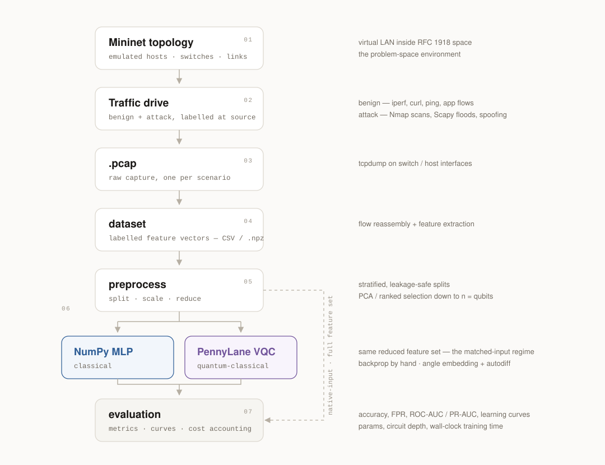

# q-ids

**Problem-space adversarial robustness of ML-based network intrusion detection** — how much *realizable* traffic manipulation does it take to evade a trained detector, measured in the traffic domain rather than on the feature vector, across a classical (NumPy MLP) and a quantum (PennyLane VQC) classifier.

> **Status: foundation built, contribution ahead.** The full detection pipeline — traffic generation scripts, feature extraction, both models, evaluation — is implemented and runs end-to-end on synthetic placeholder data. Not yet done: collecting real traffic on Linux, and the problem-space adversarial layer that is the actual research contribution. See [Roadmap](#roadmap) for exactly what exists and what doesn't.

## Overview

The saturated question in this space is "classical vs quantum ML for intrusion detection." That is *not* what this project is about. The question here is **adversarial robustness**: given a trained ML-based network intrusion detector, how hard is it to evade with traffic an attacker could actually send? The quantum model is one of the classifiers put under that test, not the headline.

Two detectors are trained on the same self-generated traffic and then attacked:

1. **Classical** — a feed-forward neural network implemented directly in NumPy (forward pass, backprop, and optimizers written out, no framework).
2. **Quantum-classical** — a variational quantum classifier (VQC) built with PennyLane, with classical pre-processing feeding a parameterized quantum circuit.

The data is not downloaded from a public corpus. It is *generated* in a controlled environment: a virtual network is emulated with Mininet, benign and attack traffic are driven through it with Scapy and Nmap, packets are captured with tcpdump, and flow-level features are extracted from the captures. This keeps ground-truth labels exact by construction and makes the attack mix reproducible. Four traffic classes: `benign`, `dos`, `recon`, `spoof`.

## The core question: problem-space, not feature-space

This distinction is the intellectual center of the project.

- **Feature-space attack** — perturb the feature vector directly (`x' = x + δ`) using the model's gradient, à la FGSM/PGD. Cheap and differentiable, but `x + δ` may correspond to *no realizable packets* — you've fooled the math, not the network. Almost all existing quantum-IDS adversarial work stops here.
- **Problem-space attack** — perturb the *actual traffic*, re-capture it, re-extract features, and check whether the trained model now misclassifies. Realizable by construction, but genuinely hard: the packets → features map is neither invertible nor differentiable.

A crucial point this project turns on: **generating evasive traffic is not the same as a problem-space attack.** Slow scans, decoys, and fragmentation are just *traffic*. The defining feature of a problem-space attack is a **model-in-the-loop search** — a trained detector is being actively evaded. The Scapy/Nmap scripts here generate attacks with fixed parameters and take no model as input; they are the *substrate* (the attacks the detectors first learn to catch), not the attack itself. The adversarial layer that perturbs those attacks against a trained model is a separate stage (see [Roadmap](#roadmap), and it is **not built yet**).

The comparison the project is built to make: **how much realizable perturbation does it take to evade the VQC versus the MLP, which is harder to fool, and do evasions transfer between them?**

## Pipeline

<picture>
  <source media="(prefers-color-scheme: dark)" srcset="docs/pipeline-dark.svg">
  
</picture>

## Tech stack

| Layer | Tool | Role |
|---|---|---|
| Network emulation | **Mininet** | Virtual topology of hosts/switches; the traffic-generation environment |
| Attack traffic | **Scapy** | Packet crafting — SYN floods, spoofed sources, malformed headers, evasive timing |
| Reconnaissance | **Nmap** | Port scans (SYN/FIN/XMAS/UDP), service and version detection |
| Capture | **tcpdump / libpcap** | Raw packet capture per scenario |
| Feature extraction | **Scapy / Python** | Flow reassembly and flow-level statistics |
| Classical model | **Python + NumPy** | MLP written from scratch — layers, backprop, SGD/Adam |
| Quantum model | **PennyLane** | Variational circuits, angle embedding, exact backprop on the `default.qubit` simulator |
| Evaluation | **NumPy + Matplotlib** | Metrics, confusion matrices, ROC/PR curves, training-cost comparison |

Deliberately **not** used for the models themselves: scikit-learn, PyTorch, TensorFlow. The classical baseline is hand-written so both models are compared on equal, fully-visible footing rather than through differently-optimized library internals. PennyLane *is* a framework, and that is deliberate too — hand-rolling quantum gradient computation would mean writing worse infrastructure than PennyLane already provides; the "no framework" rule was only ever about the classical baseline. Utility libraries (pandas, matplotlib) are fine.

> Note on gradients: on the `default.qubit` simulator the VQC trains via exact backprop, not the parameter-shift rule. Parameter-shift is what you'd use on real hardware or a shot-based device — which also shapes the adversarial threat model below (no differentiable path from features back to packets, so evasion is black-box / query-based).

## Threat model / attack classes

These are the attacks the detectors are trained to recognize — the *substrate*, generated at fixed parameters:

- **Reconnaissance** — TCP SYN scan, FIN/XMAS/NULL scans, UDP scan, service enumeration (Nmap)
- **Denial of service** — SYN flood, UDP flood, ICMP flood, slow-rate exhaustion (Scapy)
- **Spoofing** — source-address spoofing, ARP poisoning within the emulated LAN

Evasive variants — fragmented payloads, decoy addresses, timing-templated slow scans, packet-rate shaping that puts attack flows inside the benign statistical envelope — are the *seed* for the problem-space attack layer, where they stop being fixed traffic and become the search space a model-in-the-loop attacker explores. A detector that separates a full-rate SYN flood from a `ping` is not saying much; the interesting question lives near the decision boundary, which is exactly where the adversarial search operates.

## The dimensionality constraint

This shapes the whole detection experiment, and it is why the model comparison has to be set up carefully.

Simulated quantum circuits scale exponentially in qubit count, so a VQC realistically handles a small number of features — on the order of 4 to 12 with angle embedding, one feature per qubit. Flow-level IDS feature sets are typically much wider than that. So the models are compared under two regimes, produced by a shared preprocessing step so the inputs are genuinely matched:

- **Matched-input** *(primary comparison)* — both models see the same reduced feature set (PCA down to *n* = qubit count). The VQC additionally rescales those components into valid rotation angles, a monotonic per-feature transform that carries no extra information. So any measured gap reflects the **architecture**, not the inputs.
- **Native-input** *(reference)* — the classical model additionally gets the full feature set, as an upper bound on what dimensionality reduction gives up.

Matched inputs are not just tidiness here — they are a hard requirement for the robustness result to mean anything. A measured difference in how easily each model is evaded could otherwise be the input representation rather than the architecture. Parameter counts and wall-clock training cost are always reported next to accuracy: a VQC that ties the MLP while taking orders of magnitude longer to train on a simulator has not won anything, and the tables are structured to make that visible rather than hide it.

## Evaluation

**Detection**, reported for every model, per class and in aggregate:

- Accuracy, precision, recall, F1
- **False positive rate** — weighted heavily; an IDS that cries wolf is unusable regardless of recall
- ROC-AUC and PR-AUC (PR-AUC is the more honest curve here, since attack traffic is the minority class)
- Confusion matrix across classes
- Learning curves against training-set size — tests the sample-efficiency claim often made for quantum models
- Parameter count, circuit depth / qubit count, and wall-clock training time

Splits are stratified; when real captures land, flows from a single scenario run are grouped so packets from one flow cannot straddle the train/test boundary — otherwise numbers are inflated by leakage.

**Robustness** *(the contribution — not built yet)*, and the three things that decide whether the result is publishable or junk:

- **Functionality oracle, inside the loop.** The search will happily "evade" by turning a flood down until it is no longer a flood — at which point you have stopped attacking, not evaded. Every evaded candidate must pass a functional check (e.g. the victim's half-open table / response latency / drop rate in Mininet) and be rejected if it no longer produces the attack effect. Report *"evaded samples retained X% of attack efficacy."* Without that number, evasion is indistinguishable from surrender.
- **Matched inputs** — or the robustness gap is confounded with the input representation (see above).
- **Threat model + query budget.** This is black-box / query-based: no differentiable path from features back to packets, and the VQC only has parameter-shift gradients on real hardware anyway. The attacker sends traffic, observes the verdict, adapts — so report *queries-to-evasion* (50 vs 50,000 are different threats). Each query is a full Mininet round-trip (regenerate → recapture → re-extract → infer), so the search is either query-efficient (Bayesian optimization over transform parameters) or run against a fast differentiable surrogate with every hit validated by regenerating real traffic.

Then two extensions that lift it from solid to novel: **transferability** (craft against the MLP, test on the VQC and vice versa) and an **adversarial-training defense** (retrain on evaded samples, measure whether robustness recovers).

## Repository layout

```
q-ids/
├── topology/          Mininet topology + scenario runner        [written, never run on Linux]
├── traffic/
│   ├── benign/        benign traffic generators                 [written, never run on Linux]
│   └── attack/        Scapy attack scripts, Nmap scan drivers   [written, never run on Linux]
├── capture/           tcpdump orchestration, raw pcap output    [written, never run on Linux]
├── features/          extraction, synthetic generator, shared preprocessing, dataset utils
├── data/              generated datasets (gitignored; regenerate from scripts)
├── models/
│   ├── classical/     NumPy MLP + training + gradient check
│   └── quantum/       PennyLane VQC + training
├── evaluation/        from-scratch metrics + comparison harness
├── configs/           model configs + per-scenario traffic configs
└── results/           committed metric dumps and figures
```

Datasets and pcaps stay out of version control — the generation scripts plus a seeded config are the reproducible artifact, not the bytes.

## Prerequisites

**Mininet requires Linux.** It depends on network namespaces and Open vSwitch and does not run natively on Windows or macOS. Options for the data-generation half of the pipeline:

- a Linux VM (the Mininet project publishes a prebuilt image),
- WSL2 with a systemd-enabled distro and Open vSwitch installed, or
- a Linux host / container with `--privileged` and `NET_ADMIN`.

Model training and evaluation are pure Python and run anywhere. A practical split is: generate captures on Linux, copy the extracted dataset over, and train wherever is convenient.

Traffic generation needs root — Scapy raw sockets, Nmap SYN scans, and tcpdump all require elevated privileges. **Only run the attack scripts against the emulated Mininet hosts.** They target RFC 1918 addresses inside the virtual topology; pointing them at anything else is out of scope for this project and likely illegal.

## Setup

```bash
git clone https://github.com/shek014/q-ids.git
cd q-ids

python -m venv .venv
source .venv/bin/activate        # Windows: .venv\Scripts\activate
pip install -r requirements.txt
```

Mininet and Nmap are system packages, installed outside the virtualenv (Linux only):

```bash
sudo apt install mininet openvswitch-switch nmap tcpdump
```

## Usage

**Runs today, anywhere** — on synthetic placeholder data, to exercise the full model/eval pipeline:

```bash
# 1. fabricate a dataset with the real feature schema (stand-in for real captures)
python -m features.synthetic --out data/dataset.npz --n-samples 4000 --seed 0

# 2. train the classical MLP twice: native (all features) and matched (VQC's PCA features)
python -m models.classical.train --data data/dataset.npz --out results/classical_native
python -m models.classical.train --data data/dataset.npz --out results/classical_matched --pca-components 8

# 3. train the quantum VQC (slow — full circuit simulation)
python -m models.quantum.train --data data/dataset.npz --out results/quantum

# 4. compare — MLP-matched vs VQC is primary, MLP-native is the reference
python -m evaluation.compare --out results/comparison

# verify the hand-written backprop against finite differences
python -m models.classical.gradcheck
```

**Real data collection** — needs Linux + Mininet + root:

```bash
# bring up the topology, run a labelled scenario, write a pcap + per-flow label sidecar
sudo python -m topology.run --scenario configs/scenarios/synflood.yaml --out capture/

# extract flow features (labels each flow by its source host, not one label per pcap)
python -m features.extract --pcap-dir capture/ --out data/dataset.npz
```

Once real `data/dataset.npz` exists, the training and comparison commands above are identical — the synthetic generator and the real extractor emit the same schema.

## Non-goals

To keep the work honest, this project explicitly does **not** claim or attempt:

- **Quantum advantage.** Nothing runs on real quantum hardware, and no asymptotic speedup is demonstrated or implied. `default.qubit` is a classical simulator; the VQC is one architecture under test, not a faster computer.
- **A NISQ-hardware deployment story.** No noise models, no hardware-specific transpilation, no IBMQ/IonQ results. If added later it's a separate, explicitly labelled experiment.
- **Feature-space adversarial results dressed up as realizable.** Any perturbation reported as an evasion is validated in the problem space — regenerated as real traffic that still functions as an attack — or it is not claimed as one.
- **State-of-the-art benchmark accuracy.** The traffic is self-generated, not a public benchmark (CIC-IDS2017, NSL-KDD, UNSW-NB15), so raw numbers are not comparable to leaderboards. Benchmark replication is planned as a separate step for comparability, not as the headline.
- **General-purpose intrusion detection.** The attack set is scoped to the [threat model](#threat-model--attack-classes) above; no claim is made about classes outside it (application-layer exploits, malware C2, etc.).

## Roadmap

**Foundation** — done:
- [x] NumPy MLP (layers, backprop, SGD/Adam) with a finite-difference gradient check
- [x] PennyLane VQC (angle embedding, entangling layers, per-class readout)
- [x] Flow feature extraction from pcaps, validated against a hand-crafted capture
- [x] Synthetic data generator (same schema) so the pipeline runs pre-collection
- [x] Per-flow labelling by source host (source IP is a label key, never a model feature)
- [x] Shared preprocessing + matched/native input comparison, so the comparison is valid
- [x] From-scratch evaluation + comparison harness

**Data collection** — next, needs Linux:
- [ ] Scenario configs for recon, spoof, and a clean benign capture (dos exists)
- [ ] Get Mininet running on Linux (never executed — budget real debugging time)
- [ ] Validation capture: one benign + one attack flow, manually confirm labels and feature sanity
- [ ] Full collection → real `dataset.npz`, with class-balance and feature-distribution checks

**The detection experiment** — after real data:
- [ ] Train VQC + both MLP configs on real traffic; produce the comparison tables/plots

**The contribution — problem-space adversarial robustness** *(the point of the project)*:
- [ ] Model-in-the-loop evasion search over realizable traffic transforms
- [ ] Functionality oracle + retained-efficacy reporting; query-budget accounting
- [ ] Transferability (MLP ↔ VQC) and an adversarial-training defense arm
- [ ] Benchmark replication (NSL-KDD / UNSW-NB15) for comparability
- [ ] Results write-up

## License

MIT — see [LICENSE](LICENSE). Copyright (c) 2026 Abhishek Ravicharan.
